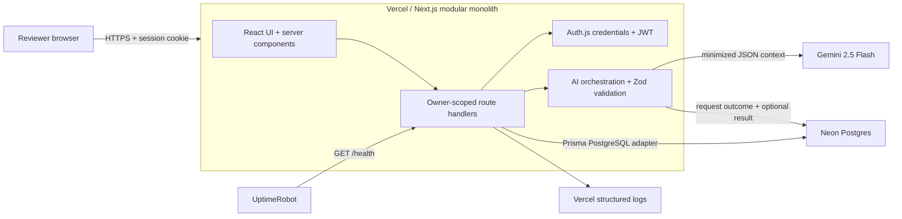
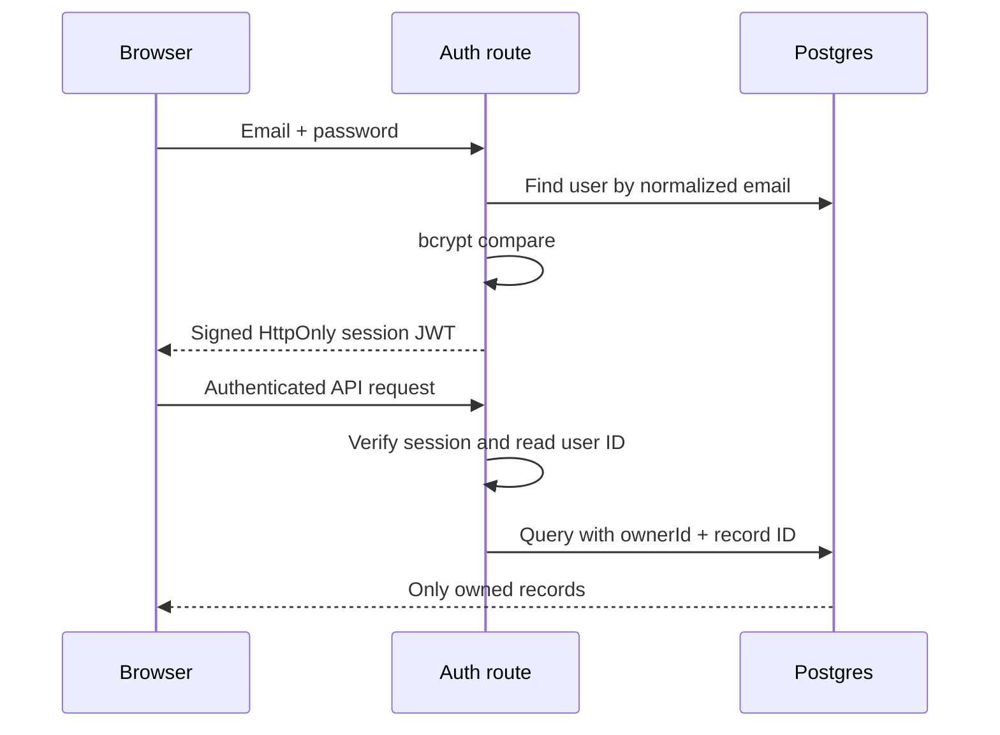
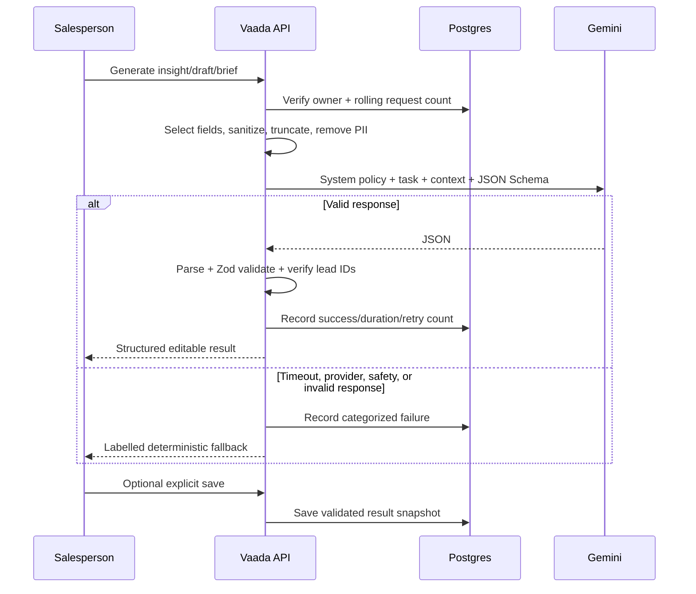

# Architecture and request flows

```mermaid
flowchart LR
  U["Reviewer browser"] -->|"HTTPS + session cookie"| V["Vercel / Next.js 16"]
  subgraph V["Vercel / Next.js modular monolith"]
    FE["React UI + server components"]
    API["Owner-scoped route handlers"]
    AUTH["Auth.js credentials + JWT"]
    AI["AI orchestration + Zod validation"]
    FE --> API
    API --> AUTH
    API --> AI
  end
  API -->|"Prisma PostgreSQL adapter"| DB["Neon Postgres"]
  AI -->|"minimized JSON context"| G["Gemini 2.5 Flash"]
  AI -->|"request outcome + optional result"| DB
  M["UptimeRobot"] -->|"GET /health"| API
  API --> L["Vercel structured logs"]
```

## Authentication and data ownership

```mermaid
sequenceDiagram
  participant B as Browser
  participant A as Auth route
  participant D as Postgres
  B->>A: Email + password
  A->>D: Find user by normalized email
  A->>A: bcrypt compare
  A-->>B: Signed HttpOnly session JWT
  B->>A: Authenticated API request
  A->>A: Verify session and read user ID
  A->>D: Query with ownerId + record ID
  D-->>B: Only owned records
```

## Structured AI flow

```mermaid
sequenceDiagram
  participant U as Salesperson
  participant A as Vaada API
  participant D as Postgres
  participant G as Gemini
  U->>A: Generate insight/draft/brief
  A->>D: Verify owner + rolling request count
  A->>A: Select fields, sanitize, truncate, remove PII
  A->>G: System policy + task + context + JSON Schema
  alt Valid response
    G-->>A: JSON
    A->>A: Parse + Zod validate + verify lead IDs
    A->>D: Record success/duration/retry count
    A-->>U: Structured editable result
  else Timeout, provider, safety, or invalid response
    A->>D: Record categorized failure
    A-->>U: Labelled deterministic fallback
  end
  U->>A: Optional explicit save
  A->>D: Save validated result snapshot
```
